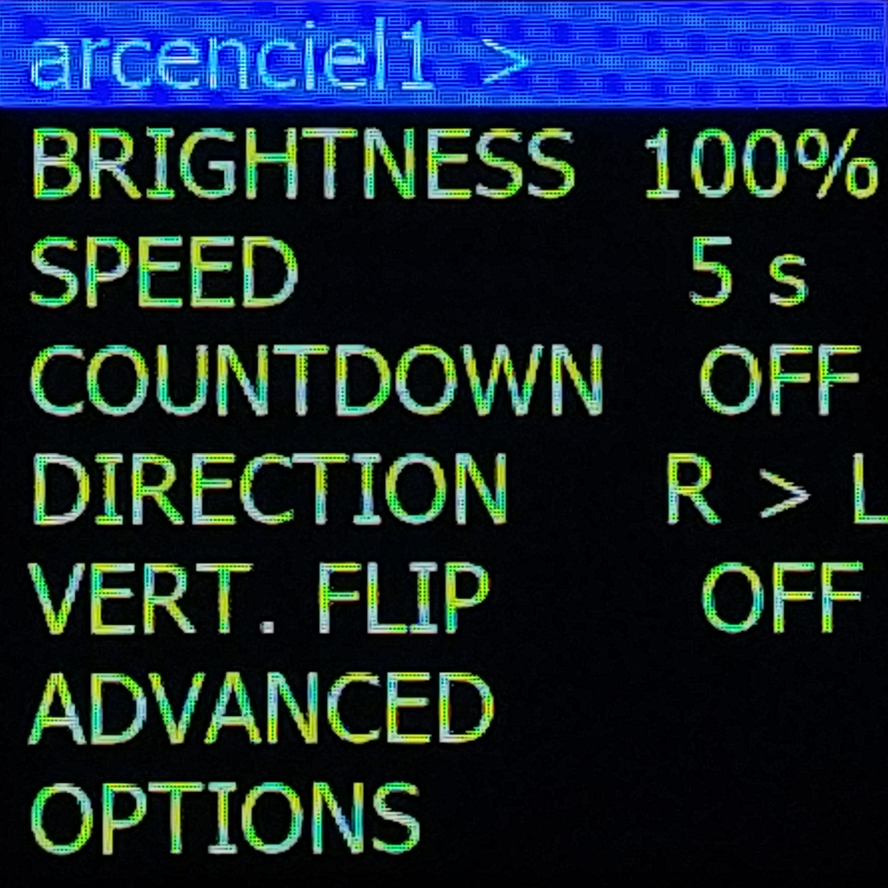
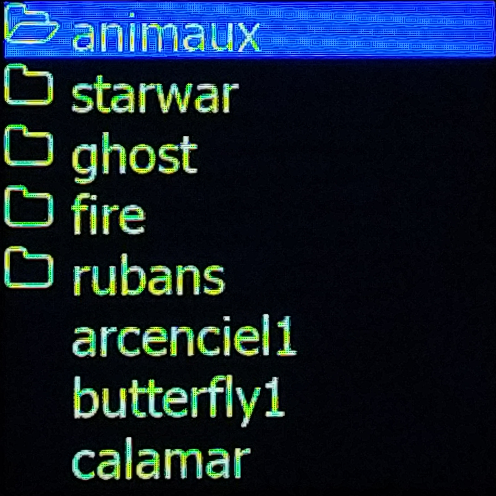
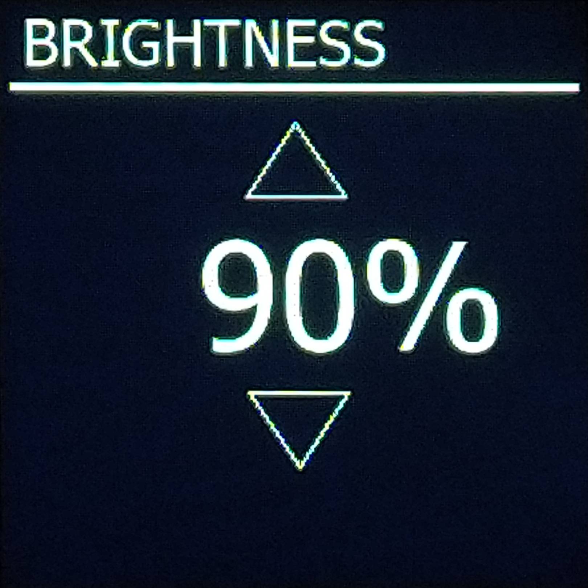

# pilightpaint

This is a light painting GUI for  Adafruit light painting stick and inspired by Pixelstick

ST7789 LCD screen 240x240 with buttons

## Main menu

  

## Image selection

  

## Brightness

  

